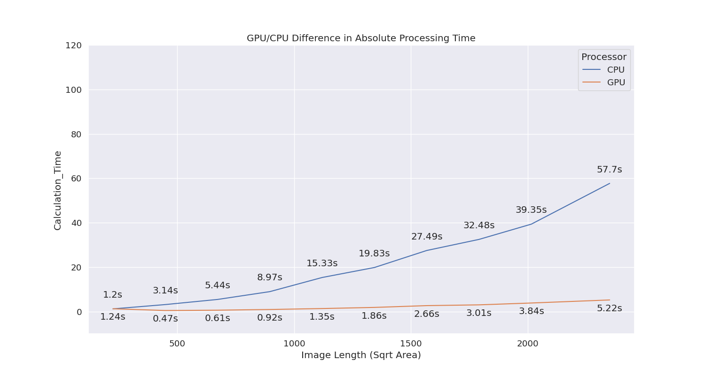
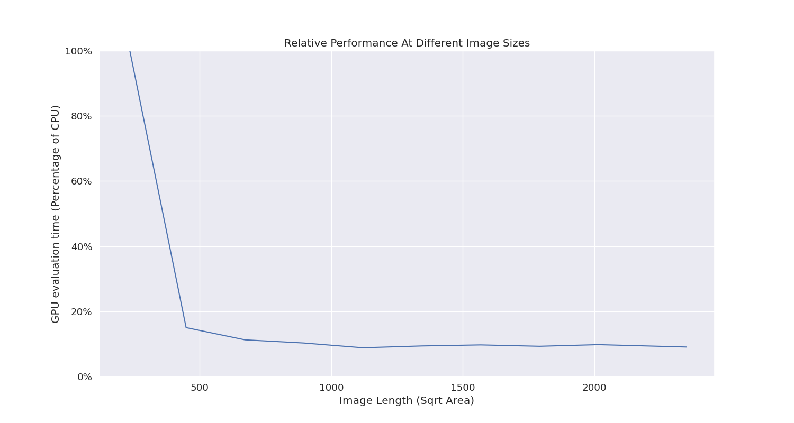

## A Benchmark for Cellpose
Benchmarking runtimes for Cellpose, using different GPU architectures compared to CPU.

## Usage
- First, run crop\_image\_centers.py to generate a series of square crops from the test image.
- Next, run successive\_crop\_benchmark.py to process all the image crops, and generate results and figures

## Results
Two figures and one CSV file will be generated. 

GPU to CPU Comparison             |  Percentage Improvement           |
:-------------------------:|:-------------------------:|
| 

## Environmental requirements
Requires:
- Cellpose latest version (with GPU enabled) v3.0.11
- Seaborn (for plotting)
- Pandas
- Numpy
- Matplotlib
- scikit-image (for image input/output)
